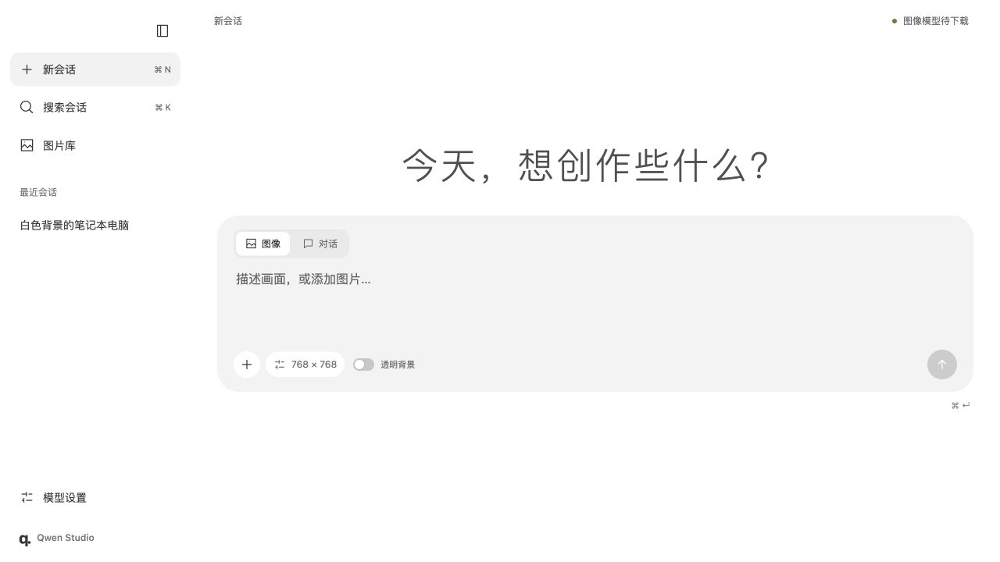
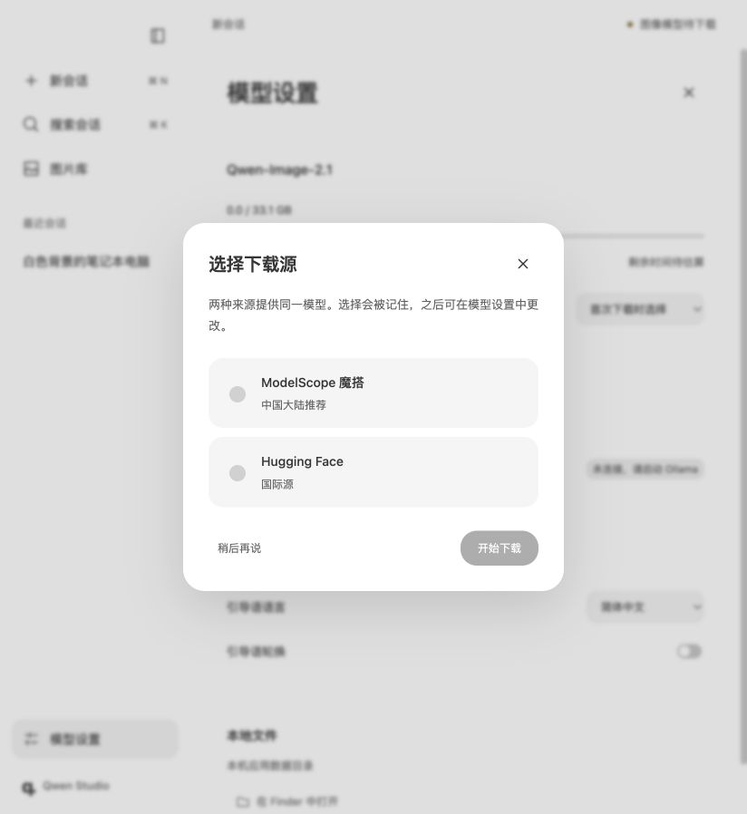

<p align="center"></p>

# Qwen Studio

English | [简体中文](README.md)

Qwen Studio provides a desktop interface for Qwen Image 2.1 where platforms such as Ollama do not yet run the image model.

Generate and edit images in a local desktop window, then use your existing Ollama models to discuss ideas. Diffusers runs Qwen-Image-2.1 for images; Ollama handles text chat. This is an independent community application with no affiliation to Qwen or Ollama.



*Screenshot of the shared interface. The Mac shell uses AppKit and WKWebView; the Windows shell uses WinForms and WebView2.*

## Download and get started

Download the ZIP for your platform from [Releases](https://github.com/rigorhormist/QwenStudio/releases/latest). First-time setup downloads Python dependencies. Choose a source and download model weights separately inside the app.

| Platform | Package | First launch |
| --- | --- | --- |
| Windows x64 | [QwenStudio-2.1.0-windows-x64.zip](https://github.com/rigorhormist/QwenStudio/releases/download/v2.1.0/QwenStudio-2.1.0-windows-x64.zip) | Extract, run `setup.cmd`, then `start.cmd` |
| Mac Apple Silicon | [QwenStudio-2.1.0-macos-arm64.zip](https://github.com/rigorhormist/QwenStudio/releases/download/v2.1.0/QwenStudio-2.1.0-macos-arm64.zip) | Extract, run `setup.command`, then open `Qwen Studio.app` |

Packages include the desktop application but **exclude Python, model weights and Ollama**. The Windows package includes the .NET runtime. Mac Python dependencies live in the application data directory, so the App can move to Applications after setup. These releases are not developer-signed or Apple-notarized.

See [Installation and downloads](docs/installation.en.md) for prerequisites, checksum verification and updates. You can use Ollama chat before downloading the image model.

## Features

- Generate images from text and edit reference images, with a transparent-background option.
- Set image dimensions, inference steps and random seed, including 2K presets.
- Switch local Ollama models and adjust thinking intensity when the selected model supports it.
- Save and search conversations, browse the image gallery, open full-size images and export PNG files.
- Queue tasks, view generation previews and stop running jobs.
- Choose ModelScope or Hugging Face on the first model download, with resumable transfers, live speed and estimated time remaining.

The interface uses white and light-gray surfaces with rounded controls and animated page transitions. Welcome prompts support Chinese, English or the system language. Most other interface labels are currently in Chinese.

<p align="center"></p>

## Requirements

| Component | Requirement or note |
| --- | --- |
| Mac | Apple Silicon, macOS 14 or later, using PyTorch MPS |
| Windows | Windows 10/11 x64, WebView2 Evergreen Runtime, an NVIDIA GPU and driver compatible with the chosen PyTorch CUDA build |
| Python | 64-bit Python 3.10–3.13; setup looks for 3.11 first |
| Model storage | About 33.1 GB for the current file manifest, plus room for download assembly, Python dependencies and generated images |
| Memory | CPU offload is enabled. Requirements depend on dimensions and workload; a general minimum has not been established |
| Text chat | Local Ollama at `http://127.0.0.1:11434` with at least one downloaded chat model |

The Mac development machine has an Apple M5 Pro and 48 GB of unified memory. The Windows desktop builds successfully; memory requirements and generation speed across NVIDIA GPUs still need reports from actual machines. Having a 2K preset does not guarantee that a particular device can finish it. Start at 512 or 768 if you encounter memory errors.

## Model sources and controls

The app runs the [official Qwen-Image-2.1 model](https://github.com/QwenLM/Qwen-Image-2.1), available from [ModelScope](https://modelscope.cn/models/Qwen/Qwen-Image-2.1) and [Hugging Face](https://huggingface.co/Qwen/Qwen-Image-2.1). Both sources resolve to the same pinned file set. The downloader verifies SHA-256 hashes before accepting newly downloaded files.

Steps and seed are Diffusers inference parameters. Steps control the number of denoising iterations; the seed controls the initial random noise. The app defaults to 40 steps and 768 × 768 to reduce the initial memory load. See the [Usage guide](docs/usage.en.md) for controls and limitations.

The decoder uses the original FP32 VAE and full-frame decoding to avoid color bands and seams introduced by lower precision or tiled decoding. Intermediate previews are decoded before being resized. The model can still produce incorrect text, unexpected details or images that do not follow the prompt.

## Local data

- Mac: `~/Library/Application Support/Qwen Studio`
- Windows: `%LOCALAPPDATA%\QwenStudio`

Conversations use SQLite. Images are stored in `images`, and weights default to `models/Qwen-Image-2.1`. Windows supports a `settings.local.json` file for other storage locations. Existing local configuration is preserved.

There is no account system or bundled telemetry. Dependency installation and model downloads contact their respective sources; text chat connects to local Ollama. See [Security and privacy](SECURITY.md).

## Build from source

```sh
git clone https://github.com/rigorhormist/QwenStudio.git
cd QwenStudio
```

Mac builds require Xcode Command Line Tools. Run `./build.sh` and `./setup.command` in `macos`. Windows builds require the .NET 10 SDK. Run `build.ps1` and `setup.cmd` in `windows`. Building the desktop shell does not require model weights.

```text
macos/       AppKit shell, MPS backend and web interface
windows/     WinForms shell, CUDA backend and web interface
assets/      Project icon
docs/        Chinese and English installation, usage and development docs
scripts/     Release packaging tools
```

See [CONTRIBUTING.md](CONTRIBUTING.md) for checks and contribution instructions. Shared interface files remain identical across platforms; process handling and GPU support are platform-specific.

## License and acknowledgments

Original application code is available under the [MIT License](LICENSE). **Model weights are not MIT-licensed.** Qwen-Image-2.1 is covered by the upstream [Qwen Research License](LICENSE.model.txt), which includes non-commercial restrictions. Release packages do not redistribute model weights.

This project uses Qwen-Image-2.1, Diffusers, PyTorch, Transformers, Ollama and Microsoft WebView2. The circular menu layout and animation were adapted from [Ramotion/CircleMenu](https://github.com/Ramotion/circle-menu), with its MIT notice retained. See [Third-party notices](THIRD_PARTY_NOTICES.md).
