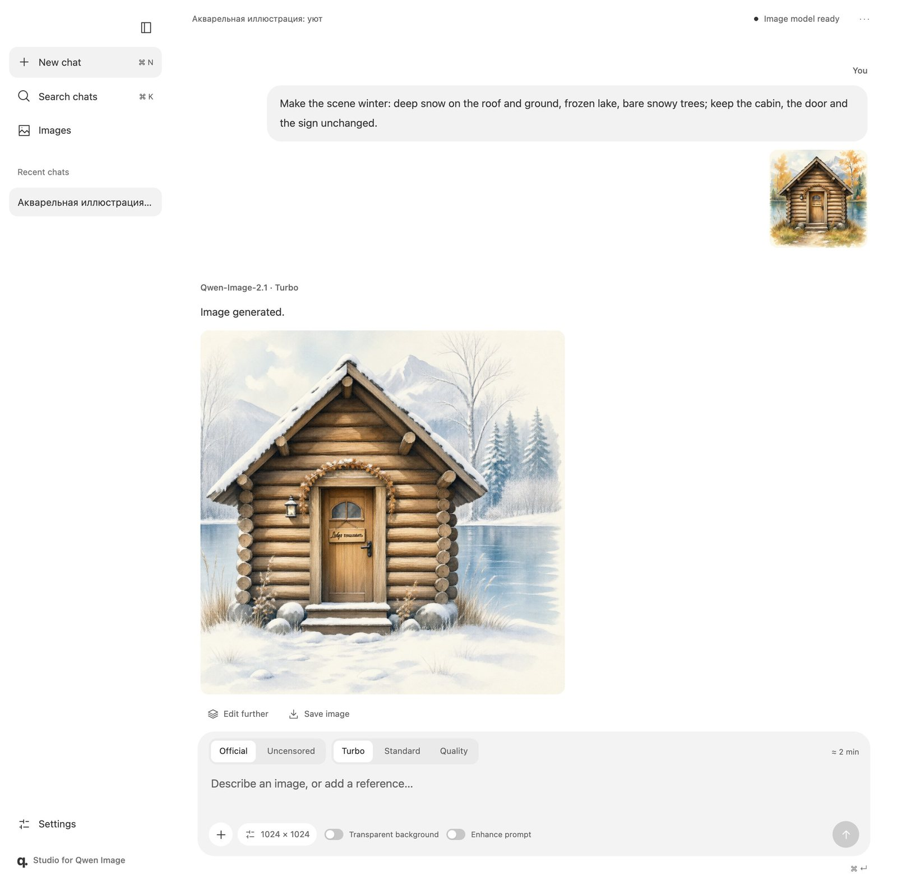
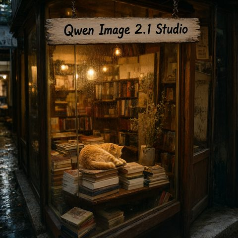

<p align="center"></p>

# Studio for Qwen Image

A local web studio for **[Qwen-Image-2.1](https://huggingface.co/Qwen/Qwen-Image-2.1)** on Apple Silicon
Macs with **32 GB** of memory: text-to-image, editing with up to 10 reference images, transparent PNGs,
local edits marked with boxes or masks, and the official prompt enhancers. Everything runs on the Mac's
GPU; prompts and images never leave the machine.

It is a fork of [rigorhormist/QwenStudio](https://github.com/rigorhormist/QwenStudio). The original
macOS app keeps about 33 GB of model weights in memory, so it cannot run on a 32 GB Mac. This fork makes
every feature of the model work there — see [what changed and why](#what-changed-compared-to-qwenstudio-and-why).

English | [Русский](README.ru.md)



## Requirements

- A Mac with Apple Silicon (M1 or newer) and **at least 32 GB** of unified memory
- macOS 14 or newer (tested on macOS 26.6, MacBook Pro M1 Max 32 GB)
- Python 3.12 or 3.13 for arm64, for example `brew install python@3.12`
- About 22 GB of free disk space for the core files (41 GB with every optional file)

## Quick start

```bash
git clone https://github.com/dimchansky/studio-for-qwen-image.git
cd studio-for-qwen-image
./setup.sh      # creates .venv and installs pinned packages (~1.5 GB)
./download.sh   # core model files (~19.4 GB), resumable, SHA-256 verified
./run.sh        # starts the studio and opens http://127.0.0.1:8765
```

Optional files can be downloaded later in **Settings → Model files**, or with `./download.sh --all`:
the uncensored model (7.6 GB) and the two prompt enhancers (6 GB each).

## Features

Everything Qwen-Image-2.1 can do is driven by the prompt plus 0–10 reference images, which you refer to
as `<image1>` … `<image10>`:

- **Text to image** at 1K (default) or 2K, with accurate text rendering in English and Chinese.
- **Transparent PNGs** (RGBA): one switch next to the prompt.
- **Editing**: continue from any result or upload pictures; up to **10 references** (try-on, group photos,
  furnishing a room from product shots…).
- **Local edits**: in the image viewer, mark areas with a circle, box or brush in five colours, or paint a
  separate mask — the studio adds the prompt wording used in the official examples.
- **Task templates**: background removal, extract an object, change background, product scene, replace
  or translate text, restyle, style from a reference, try-on, face swap, group photo, expression and
  pose, restore and colourise, outpaint, 360° panorama, character turnaround, infographic.
- **Official prompt enhancers** (PE-T2I / PE-I2I): turn a short idea into a detailed prompt and pick the
  aspect ratio.
- **Two models**: the official weights, or an optional community “uncensored” version.
- **Speed presets**: Turbo (4 steps), Standard (25), Quality (40), with a time estimate before you send.
- Negative prompt and guidance, seeds, 1–4 images per job, queue, cancel, live preview, gallery,
  generation details, English/Russian/Chinese interface.

| Text rendering | Prompt enhancer | Turbo (4 steps) | Transparent PNG | Edit: before | Edit: after |
|---|---|---|---|---|---|
|  |  |  |  |  |  |

## Speed on a MacBook Pro M1 Max (32 GB)

| Job (1024 × 1024) | Time |
|---|---|
| Text to image, Turbo | ≈ 1.5 min |
| Text to image, Standard (25 steps) | ≈ 6 min |
| Text to image, Quality (40 steps) | ≈ 9 min |
| Edit with 1 reference, Turbo | ≈ 2 min |
| Edit with 1–5 references, 12 steps | 4–5.5 min |
| Prompt enhancer (adds) | 45–60 s |

Newer chips are faster. 2K images take 6–7 times longer than 1K. The estimate next to the prompt learns
from the jobs you run.

## What changed compared to QwenStudio, and why

In plain words — each point is a problem we hit on a 32 GB Mac and what the fork does about it.

1. **The model did not fit into memory.** The original app loads the text encoder, the image model and
   the decoder at full 16-bit precision — about 33 GB of weights — while the Mac has 32 GB in total.
   *Now* every job runs as up to three short steps, each in its own process that exits (and frees its
   memory) before the next one starts: prompt enhancer → text encoder → image model. The weights are
   also compressed with almost no visible loss: the image model to 8 bits (7.6 GB instead of 14.2), the
   text encoder to 8 bits (10 GB instead of 17.5) and the prompt enhancers to 4 bits (6 GB instead of 19).
2. **Every edit came out broken.** A bug in PyTorch's Apple GPU backend corrupts one padding operation
   inside the image encoder, so every reference image was damaged (reconstruction quality 10 dB instead of
   42 dB). *Now* that operation is replaced by an equivalent one; the result is bit-for-bit the same as
   on the CPU.
3. **M1–M3 chips were slow.** They have no hardware support for the bfloat16 number format. *Now* the
   studio computes in float16: 9.6 s per step instead of 16.3 s. If numbers ever overflow, it retries
   in bfloat16 automatically.
4. **Turning the result into pixels needed 18 GB more.** *Now* this happens after the image model is
   unloaded and in 16 bits (8.6 GB, visually identical to 32 bits). 2K images are decoded in overlapping
   tiles.
5. **Many reference images ran out of memory.** Each 1024 px reference costs about 2.5 GB of cache.
   *Now* the studio lowers the reference resolution just enough to stay within 6 GB (for example 3
   references at 896 px, 10 at 384 px) and shows this under the prompt.
6. **There was no fast mode.** *Now* “Turbo” uses a 4-step distilled LoRA: a picture in about 1.5
   minutes instead of 6.
7. **Only one model.** *Now* you can switch between the official weights and an optional community
   “uncensored” version (a third-party modification whose method is not documented).
8. **Downloading needed ~43 GB of free space at once and full-precision weights.** *Now* a pinned list
   of compressed files (19.4 GB for the core set) is downloaded one file at a time, checked against its
   SHA-256, and the studio refuses to start a file that would not fit on the disk.
9. **A desktop wrapper and an Ollama chat.** *Now* it is a plain web app for any browser on your Mac
   (bound to `127.0.0.1`). The chat mode was removed because it is unrelated to Qwen-Image; the Windows
   version stays in the upstream project.
10. **The interface** gained the model and speed switches with time estimates, task templates, box and
    colour annotations, a low-memory warning, a diagnostics page and a Russian translation.
11. **Tests and hardware checks** cover all of the above (`macos/tests`, `scripts/spikes`).

## How it works

```
browser ──HTTP──▶ server.py (queue, sessions, downloads; no model code)
                     │ one job = up to three disposable processes, one after another
                     ├─▶ enhancer_worker.py  PE-T2I / PE-I2I, 4-bit MLX            (~6 GB)
                     ├─▶ encode_worker.py    Qwen3-VL-8B text encoder, 8-bit SDNQ  (~12 GB) → cached embeddings
                     └─▶ worker.py           image model GGUF Q8_0 + VAE, float16  (14–19 GB)
```

Weights live in `data/models`, pinned to exact Hugging Face revisions in
[`macos/backend/models.json`](macos/backend/models.json). The diffusers version is pinned to a commit
because Qwen-Image-2.1 is not in a diffusers release yet.

## Settings

`run.sh` sets sensible defaults; override any of them in the environment:

| Variable | Default | Meaning |
|---|---|---|
| `QWEN_STUDIO_PORT` | `8765` | Port on `127.0.0.1` |
| `QWEN_STUDIO_DATA` | `./data` | Models, images, chats and logs |
| `QWEN_STUDIO_DTYPE` | `auto` | `auto` (float16 with bfloat16 retry), `fp16` or `bf16` |
| `QWEN_STUDIO_KV_BUDGET_GB` | `6` | Cache budget for reference images; raise it on 64 GB+ Macs |
| `QWEN_STUDIO_ATTN_BUDGET_MB` | `512` | Size of attention slices on the GPU |
| `QWEN_STUDIO_THINKING_BUDGET` | `3072` | Default thinking length of the prompt enhancer |
| `PYTORCH_MPS_HIGH_WATERMARK_RATIO` | `1.0` | GPU memory cap, so an oversized job fails instead of swapping |

## Troubleshooting

- **“Not enough memory”** — close memory-heavy apps (browsers with many tabs, video editors). Jobs need
  12–19 GB; the studio warns when less than 10 GB is free.
- **The first job is slow** — loading the models takes 40–60 s; later jobs with the same prompt reuse the
  encoded prompt.
- **Cyrillic or other text looks approximate** — the model renders English and Chinese best. Use Quality
  mode and short phrases.
- **Something else** — Settings → Environment check, and the job logs in `data/jobs/<id>.log`.

## Development

```bash
.venv/bin/python -m unittest discover -s macos/tests -p 'test_*.py'
.venv/bin/python -m unittest discover -s tests && node tests/i18n.test.cjs
```

Hardware checks that measure speed, memory and correctness on your Mac are in
[`scripts/spikes`](scripts/spikes/README.md). Interface text lives in `macos/web/locales`
(`python3 scripts/build_locales.py` rebuilds the bundle); the model list is rebuilt with
`python3 scripts/build_manifest.py`.

## Licenses and credits

- Code: MIT, © Qwen Studio contributors and © Dmitrij Koniajev (Apple Silicon port). See [LICENSE](LICENSE).
- Qwen-Image-2.1 and its prompt enhancers: [Qwen Research License](LICENSE.model.txt) —
  **non-commercial use only**. Built with Qwen. The weights are downloaded separately and are not part
  of this repository.
- Model files come from [Qwen](https://huggingface.co/Qwen/Qwen-Image-2.1) (configs, VAE),
  [unsloth](https://huggingface.co/unsloth/Qwen-Image-2.1-GGUF) (GGUF), [OzzyGT](https://huggingface.co/OzzyGT/Qwen_Image_2_1_sdnq_dynamic_8bit)
  (8-bit text encoder), [prithivMLmods](https://huggingface.co/prithivMLmods/Qwen-Image-2.1-PE-T2I-MLX) (MLX prompt enhancers),
  [Viggle](https://huggingface.co/Viggle/Qwen-Image-2.1-viggle-turbo) (turbo LoRA) and, optionally,
  [abenzerps](https://huggingface.co/abenzerps/Qwen-Image-2.1-Uncensored-GGUF) (uncensored GGUF). Each keeps its own terms;
  see [THIRD_PARTY_NOTICES.md](THIRD_PARTY_NOTICES.md).
- “Qwen” is used only to describe compatibility. This project is not affiliated with Qwen, Alibaba or
  the upstream author.
